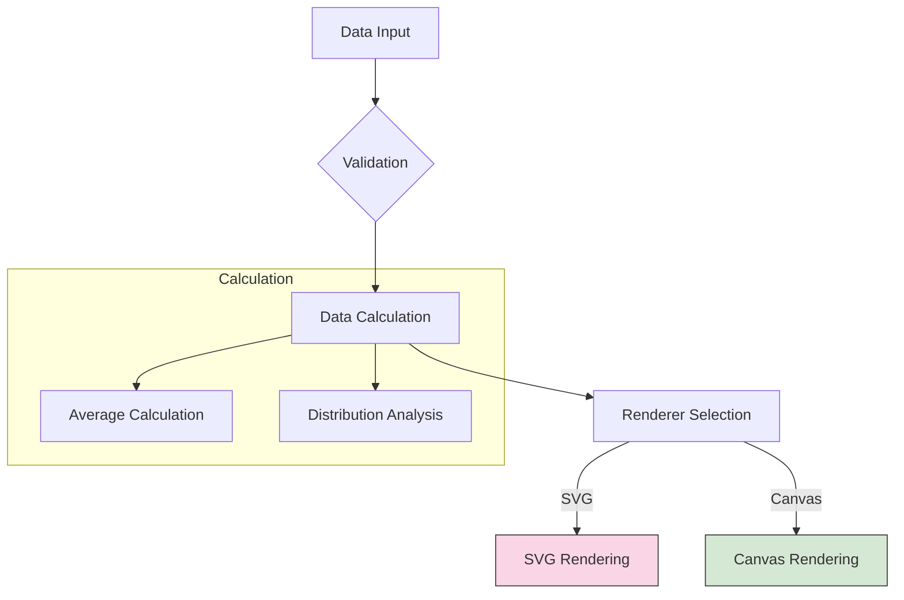

# Augmented Radar Chart

## Usage

```html
<augmented-radar-chart-svg id="chart"></augmented-radar-chart-svg>

<script type="module">
import { AugmentedRadarChartSVG } from 'augmented-radar-chart';
customElements.define('augmented-radar-chart-svg', AugmentedRadarChartSVG);

const chart = document.getElementById('chart');
chart.data = {
  'Dimension 1': { data: [25, 30, 28] },
  'Dimension 2': { data: [15, 20, 18] }
};
chart.config = {
  size: 600,
  band: 2
};
</script>
```

## Pipeline



### Structure

```text
src/
├── components/        # Chart implementation classes
│   ├── AugmentedRadarChartBase.ts
│   ├── AugmentedRadarChartSVG.ts
│   └── AugmentedRadarChartCanvas.ts
├── constant.ts        # Configuration defaults
├── utils/             # Utility functions
├── types.ts           # Type definitions
└── index.ts           # Public API entry
```
