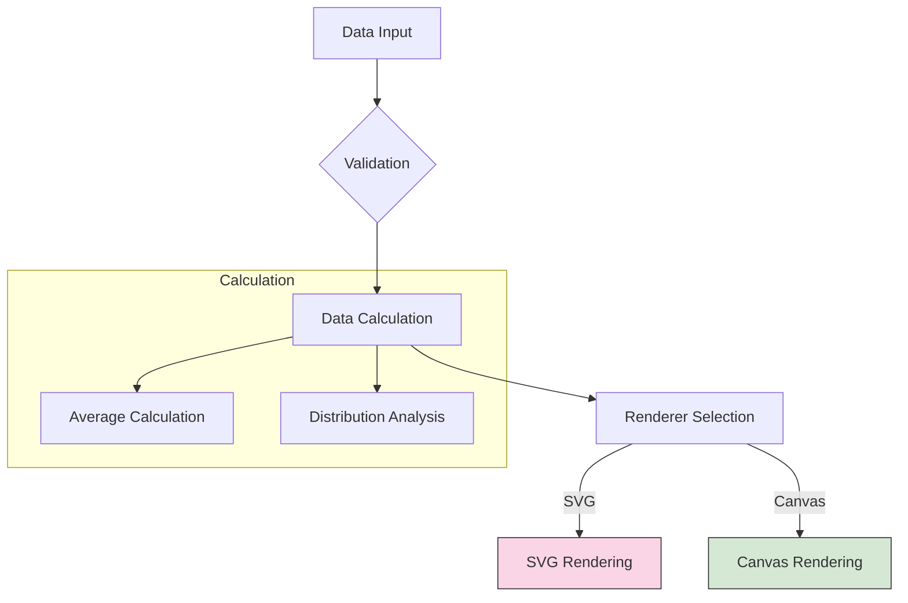

# Augmented Radar Chart

## Pipeline



---
## Develop Guidelines
- Run the following code in **root directory** to install required dependencies：
```bash
pnpm install
```
- Start development servers
```bash
pnpm dev:umd    # UMD build
pnpm dev:esm    # ES Module build 
pnpm dev:vite   # Vite playground
```

### Structure

```text
src/
├── components/        # Chart implementation classes
│   ├── AugmentedRadarChartBase.ts
│   ├── AugmentedRadarChartSVG.ts
│   └── AugmentedRadarChartCanvas.ts
├── constant.ts        # Configuration defaults
├── utils/             # Utility functions
├── types.ts           # Type definitions
└── index.ts           # Public API entry
```
