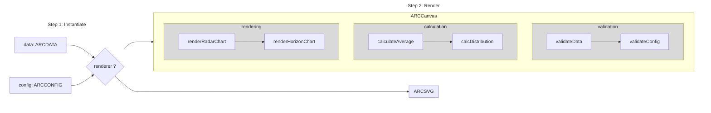

# Augmented Radar Chart

- **Radar Chart** is suitable for displaying multi-dimensional data, but each dimension can only represent a single attribute.
- **Horizon Chart** is suitable for showing distribution of single-dimensional data but is hard to handle multi-dimensional data.


We propose **Augmented Radar Chart**, which combines the features of both radar charts and horizon charts, allowing simultaneously visualize single attribute of multidimensional data and distribution of each dimension.


## Quick Start

```typescript
import augmented-radar-chart as arc;

arc.draw(data, config);
```
## Pipeline



---
## Develop Guidelines
- Run the following code in **root directory** to install required dependencies：
```bash
pnpm install
```
- Start project in dev mode
```bash
pnpm dev:umd / pnpm dev:esm / pnpm dev:vite
```
- Run tests in `packages/augmented-radar-chart`
```bash
cd packages/augmented-radar-chart
pnpm test
```

### Structure

```text
augmented-radar-chart/
├── dist/                     # Output directory for the build
├── node_modules/             # Project dependencies
├── src/
│   ├── calculation/          # Logic for data calculation
│   ├── rendering/            # Logic for rendering chart 
│   ├── validation/           # Logic for parameter validation
│   ├── charts/               # Implementation of the radar chart class
│   ├── index.ts              # Main entry point for the module
│   ├── type.ts               # Type definitions

```

`index.ts`: The main entry point of the project. It solely exposes the `draw()` function, which users can call by passing in data and styles (both data and styles are necessary for rendering the chart). The chart is then rendered in the specified DOM element.

`type.ts`: Defines all the types used in the project, primarily two as follows:
- `AugmentedRadarChartData`: The data type required for the augmented radar chart.
- `AugmentedRadarChartConfig`: The style configuration type for the augmented radar chart, which includes user-customizable options. 

See the code for details.

`chart.ts`: Defines the abstract class `AugmentedRadarChart`. All classes that extend AugmentedRadarChart must implement `draw()` method. The use of an abstract class is intended to ensure extensibility and reuse of validation and calculation logic:
Validation and calculation logic can be shared. Rendering logic, however, is difficult to share completely due to the differences in rendering methods.

`validation/`, `calculation/`, and `rendering/`: contain specific implementations and test cases for validation, calculation, and rendering.

- `validation/`: Validates whether the provided data and styles are legal (e.g., checking for boundary conditions like negative sizes, or mismatched dimension names between data and styles).

- `calculation/`: Computes the average value and distribution for each dimension.

- `rendering/`: Implements the rendering logic for the radar chart and the horizon chart.
